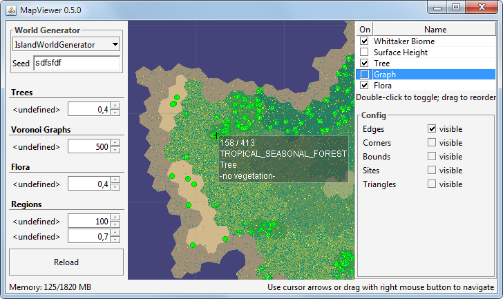

WorldViewer
=========

A world-generator based map viewer for Terasology

Download
-----------

You can download the [latest nightly build](http://jenkins.terasology.org/job/WorldViewerNightly/lastSuccessfulBuild/artifact/build/distributions/WorldViewer.zip) from our Jenkins server.

Overview
-----------

This a 2D map viewer for Terasology world generators. Its main purpose is to preview generated facets for faster and easier debugging.

To some extent, [FacadeAWT](https://github.com/MovingBlocks/FacadeAWT) and [Minimap](https://github.com/Terasology/minimap) are similar to this project. 

License
-------------

This software is licensed under the [Apache 2.0 License](http://www.apache.org/licenses/LICENSE-2.0.html).
